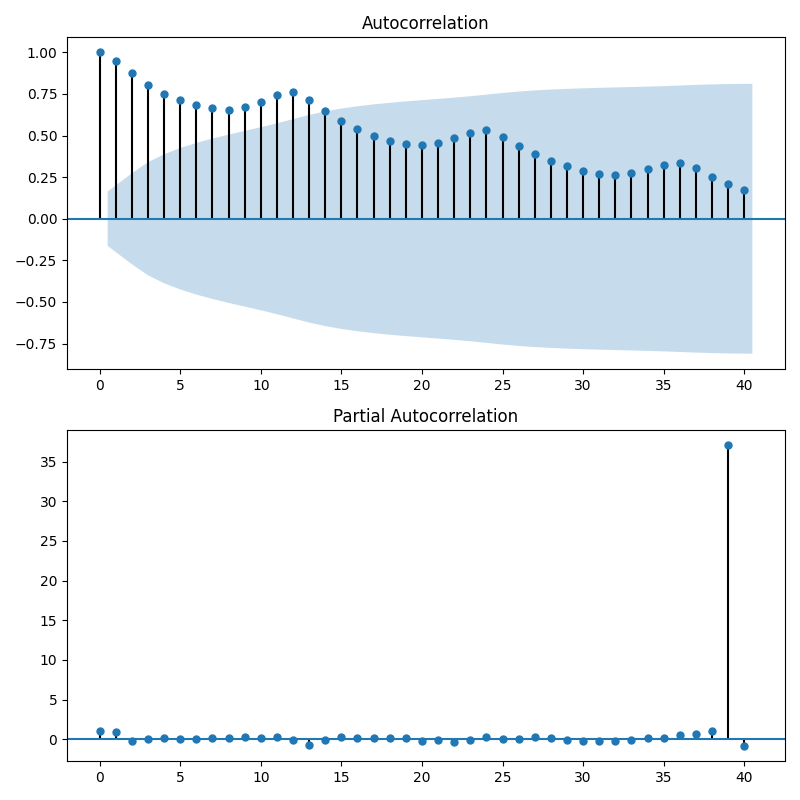

# Chronological data

## reference
https://www.slideshare.net/ssuser49f8441/python-114923273

## Terminology
- **ACF: Autocorrelation Function（自己相関）** 
How affectied is now data by some old datas. 
※lag => How many steps was it shifted?

- **PACF: Pertical Autocorrelation Function(偏自己相関)** 
This is what was removed affected time from ACF.

- **SARIMA Model:Seasonal AutoRegressive Integrated Moving Average(季節性自己回帰和分移動平均)**

## Memo
